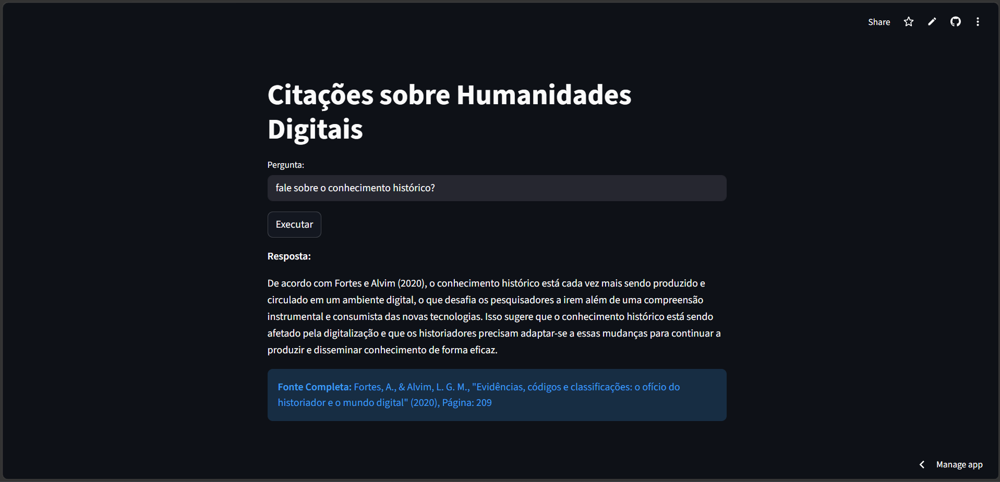

# RAG-HD 📚



**RAG-HD** (Retrieval-Augmented Generation para Humanidades Digitais) é um assistente acadêmico construído com Python e Streamlit, projetado para buscar e responder a perguntas baseadas em um banco de dados de citações e artigos sobre Humanidades Digitais. Este projeto surgiu como uma forma de organizar as citações dos artigos e livros que estou lendo no meu mestrado. O sistema utiliza modelos de linguagem de última geração para embeddings e geração de respostas, garantindo respostas precisas e sempre citando as fontes corretas.

🌐 **Acesse o App:** [https://rag-hd.streamlit.app/](https://rag-hd.streamlit.app/)

Desenvolvido por **[OYanEnrique](https://github.com/OYanEnrique)**.

---

## 🚀 Tecnologias Utilizadas

Este projeto foi construído utilizando as seguintes tecnologias e bibliotecas:

*   **[Streamlit](https://streamlit.io/):** Framework para a criação da interface gráfica de usuário (UI) de forma rápida e interativa.
*   **[ChromaDB](https://www.trychroma.com/):** Banco de dados vetorial open-source utilizado para armazenar os embeddings das citações e realizar buscas de similaridade de forma eficiente.
*   **[Google GenAI (Gemini)](https://ai.google.dev/):** API do Google utilizada para gerar os embeddings de texto usando o modelo `gemini-embedding-2`.
*   **[Groq](https://groq.com/):** Plataforma de inferência ultra-rápida utilizada para o modelo de geração de texto (LLM) `llama-3.3-70b-versatile`, responsável por formular a resposta final.
*   **Python:** Linguagem de programação base do projeto.

---

## ⚙️ Como Funciona?

O fluxo da aplicação RAG (Retrieval-Augmented Generation) neste projeto segue as etapas abaixo:

1.  **Carregamento e Vetorização:** Ao iniciar, o sistema carrega uma lista de citações pré-definidas do arquivo `database.py`. Estes textos são convertidos em vetores (embeddings) pela API do Gemini e armazenados localmente no ChromaDB.
2.  **Busca de Contexto:** Quando o usuário insere uma pergunta na interface do Streamlit, essa pergunta também é vetorizada. O ChromaDB busca a citação mais semelhante à pergunta do usuário.
3.  **Geração com LLM:** O contexto encontrado é enviado para a API do Groq (utilizando o modelo Llama 3), juntamente com um prompt de sistema estrito. O prompt obriga o modelo a agir como um assistente acadêmico, respondendo **apenas** com base no contexto fornecido e sempre referenciando a fonte (Autor, Ano, Página).
4.  **Verificação de Alucinação:** Se a informação não for encontrada no contexto da base, o modelo foi instruído a retornar explicitamente `"INFORMAÇÃO_NÃO_ENCONTRADA"`, garantindo que o assistente não invente respostas (alucinação).

---

## 📂 Estrutura do Projeto

*   `app.py`: Arquivo principal da aplicação. Contém a configuração do Streamlit, inicialização dos clientes (Google e Groq), lógica do ChromaDB e o fluxo principal do RAG.
*   `database.py`: Atua como um banco de dados simulado contendo a lista de dicionários com os metadados dos artigos (id, nome, autores, citação, página, ano e data de leitura).
*   `README.md`: Documentação do projeto.

---

## 🛠️ Como Executar Localmente

Siga os passos abaixo para rodar o projeto em sua máquina local.

### 1. Pré-requisitos

Você precisará ter o Python instalado e as seguintes chaves de API:
*   [Google AI Studio API Key](https://aistudio.google.com/app/apikey) (para embeddings)
*   [Groq API Key](https://console.groq.com/keys) (para o modelo LLM)

### 2. Instalação das Dependências

Crie um ambiente virtual (recomendado) e instale as bibliotecas necessárias:

```bash
pip install streamlit chromadb groq google-genai
```

### 3. Configuração das Variáveis de Ambiente

No arquivo `app.py`, as chaves de API estão sendo chamadas diretamente no código (`GOOGLE_API_KEY` e `GROQ_API_KEY`). **Você precisará definir essas variáveis de ambiente em sua máquina ou inseri-las diretamente no código (não recomendado para produção).**

### 4. Executando o app

No terminal, navegue até a pasta do projeto (`RAG-HD`) e execute o seguinte comando:

```bash
streamlit run app.py
```

A interface web abrirá automaticamente no seu navegador padrão (geralmente em `http://localhost:8501`).

---

## 💡 Exemplos de Uso

Na interface do aplicativo, você verá o título **"Citações sobre Humanidades Digitais"**.
Experimente perguntar algo como:

> *"O que a produção acadêmica exige segundo Diniz?"*
> *"Como o ambiente digital afeta o ofício do historiador?"*

O aplicativo retornará a resposta baseada nos textos cadastrados em `database.py` e fornecerá a referência exata.

---

## 👤 Autor

<br>

<div align="center">

<br>

**Autor do Projeto:** [Yan Enrique (OYanEnrique)](https://github.com/OYanEnrique)  
*(Cientista de Dados | Machine Learning Engineer)*

</div>

---

## 📝 Licença

Este projeto está sob a licença **MIT**. Veja o arquivo [LICENSE](LICENSE) para mais detalhes.
